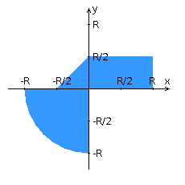

# Point Area Analyzer

Full-Stack веб-приложение для анализа попадания координат в заданную область на координатной плоскости.



## Описание проекта
В рамках разработки данного приложения были реализованы следующие архитектурные и технические решения:
- Создано 5 RESTful эндпоинтов на стороне сервера и переиспользуемые UI-компоненты на клиенте (Angular).
- Система безопасной аутентификации на базе JWT-токенов.
- Слой доступа к данным реализован с использованием jOOQ (выполнена миграция со Spring Data JPA).
- Полная контейнеризация экосистемы приложения с помощью Docker.

## Технологический стек
- **Backend:** Java, Spring Boot, jOOQ, JWT
- **Frontend:** Angular, TypeScript, HTML, CSS
- **База данных:** PostgreSQL
- **Инфраструктура:** Docker, Gradle

## Как запустить? 

### Через Docker
todo

### Локально
**Требования:** JDK 21, Node.js, PostgreSQL.
1. Создайте БД в PostgreSQL и обновите `url`, `username` и `password` в файле `src/main/resources/application.properties`.
2. Сгенерируйте секретный ключ JWT командой `openssl rand -base64 64` и добавьте его в `application.properties` (свойство `jwt.secret`).
**Сборка и запуск Backend:**
```bash
./gradlew build
java -jar build/libs/lab4.jar
```
**Сборка и запуск Frontend:**
```bash
cd frontend
npm install
ng serve
```
Сервис будет доступен по адресу http://localhost:4200/
