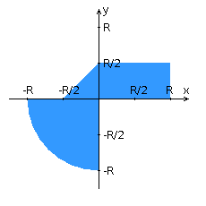

# Point Area Analyzer

Full-Stack веб-приложение для анализа попадания координат в заданную область на координатной плоскости.



## Описание проекта

В рамках разработки данного приложения были реализованы следующие архитектурные и технические решения:

- Создано 5 RESTful эндпоинтов на стороне сервера и переиспользуемые UI-компоненты на клиенте (Angular).
- Система безопасной аутентификации на базе JWT-токенов.
- Слой доступа к данным реализован с использованием jOOQ (выполнена миграция со Spring Data JPA).
- Полная контейнеризация экосистемы приложения с помощью Docker.

## Технологический стек

- **Backend:** Java, Spring Boot, jOOQ, JWT
- **Frontend:** Angular, TypeScript, HTML, CSS
- **База данных:** PostgreSQL
- **Инфраструктура:** Docker, Gradle

## Как запустить?

### Через Docker

- Сгенерируйте секретный ключ JWT командой `openssl rand -base64 64` и добавьте его в
  `backend/src/main/resources/application.properties` (свойство `jwt.secret`).
- Выполните ```docker-compose up --build```
- Сервис будет доступен по адресу http://localhost:4200/

### Локально

**Требования:** JDK 21, Node.js, PostgreSQL.

1. Создайте БД в PostgreSQL и обновите `url`, `username` и `password` в файле
   `backend/src/main/resources/application.properties`.
2. Сгенерируйте секретный ключ JWT командой `openssl rand -base64 64` и добавьте его в
   `backend/src/main/resources/application.properties` (свойство `jwt.secret`).

**Подготовка Базы данных**

```bash
psql -U <username> -d <database_name> -f backend/src/main/resources/init.sql
```

**Сборка и запуск Backend:**

```bash
cd backend
./gradlew myBuild
java -jar build/libs/app.jar
```

**Сборка и запуск Frontend:**

```bash
cd frontend
npm install
ng serve
```

Сервис будет доступен по адресу http://localhost:4200/

## Функциональные тесты

Проект включает 15 функциональных тестов на базе Playwright.
- Тесты автоматически запускаются при обычной сборке `./gradlew myBuild` (всё приложение поднимается в докере, прогоняются тесты и докер выключается)

**Как запустить только функциональные тесты?**
- Запустить тесты внутри докера: `docker compose --profile functional-test up --abort-on-container-exit`
- Запустить тесты локальной (поднимутся контейнеры специально для тестов):
    ```bash
    cd backend
    .\gradlew functionalTest
    ```
